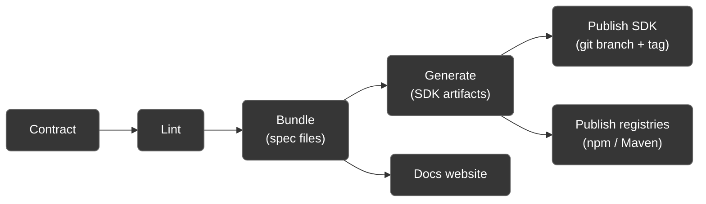
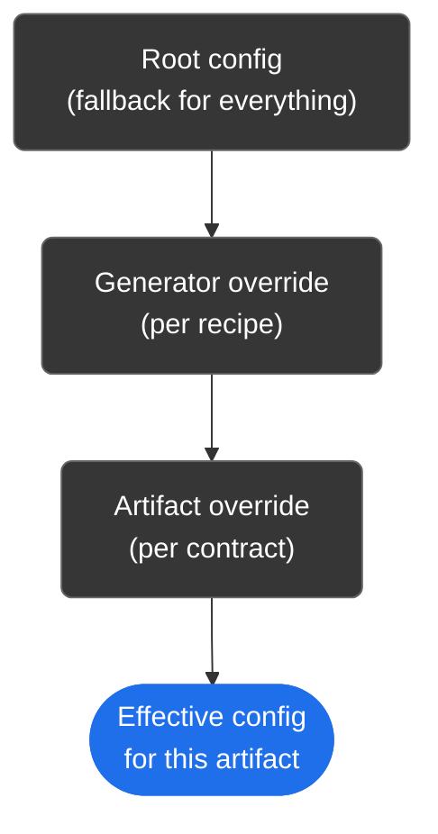

<!--suppress HtmlDeprecatedAttribute, HtmlUnknownTarget -->
<div align="center">
  <!--
  =====================
         HEADER
  =====================
  -->
  <br />
  <a rel="noopener noreferrer" href="https://github.com/OctalMesh/Seagull">
    <picture>
      <source media="(prefers-color-scheme: light)" srcset="./.github/assets/svg/seagull_logo.svg">
      
    </picture>
  </a>
  <br /><br /><br />
  <!--
  =====================
         BADGES
  =====================
  -->
  <div>
    <!-- Repo Stars Badge -->
    <a rel="noopener noreferrer" href="https://github.com/OctalMesh/Seagull/stargazers">
      <picture>
        <source media="(prefers-color-scheme: light)" srcset="https://img.shields.io/github/stars/OctalMesh/Seagull?style=for-the-badge&logo=starship&color=363636&labelColor=464646" />
        
      </picture>
    </a>
    <!-- Repo Contributors Badge -->
    <a rel="noopener noreferrer" href="https://github.com/OctalMesh/Seagull/contributors">
      <picture>
        <source media="(prefers-color-scheme: light)" srcset="https://img.shields.io/github/contributors/OctalMesh/Seagull?style=for-the-badge&logo=githubsponsors&logoColor=fff&color=363636&labelColor=464646" />
        
      </picture>
    </a>
    <!-- Repo Views Badge -->
    <a rel="noopener noreferrer" href="https://hits.sh/github.com/OctalMesh/Seagull">
      <picture>
        <source media="(prefers-color-scheme: light)" srcset="https://hits.sh/github.com/OctalMesh/Seagull.svg?style=for-the-badge&label=Views&logo=github&color=363636&labelColor=464646" />
        
      </picture>
    </a>
    <br />
    <!-- Version Badge -->
    <a rel="noopener noreferrer" href="https://npmjs.com/package/@octalmesh/seagull">
      <picture>
        <source media="(prefers-color-scheme: light)" srcset="https://img.shields.io/npm/v/@octalmesh/seagull?style=for-the-badge&label=Version&color=363636&labelColor=464646&logo=data:image/svg%2bxml;base64,PHN2ZyB4bWxucz0iaHR0cDovL3d3dy53My5vcmcvMjAwMC9zdmciIHdpZHRoPSIxNiIgaGVpZ2h0PSIxNiI+PHBhdGggZmlsbD0iI2ZmZiIgZD0iTTEgNy44di01UTEuMiAxLjIgMi44IDFoNXEuNyAwIDEuMi41bDYuMyA2LjNhMiAyIDAgMCAxIDAgMi40bC01IDVhMiAyIDAgMCAxLTIuNSAwTDEuNSA5QTIgMiAwIDAgMSAxIDcuOG0xLjUgMFY4bDYuMyA2LjJoLjRsNS01di0uNEw4IDIuNmwtLjItLjFoLTVsLS4zLjNaTTYgNWExIDEgMCAxIDEgMCAyIDEgMSAwIDAgMSAwLTIiLz48L3N2Zz4=" />
        
      </picture>
    </a>
    <!-- NPM Downloads Badge -->
    <a rel="noopener noreferrer" href="https://www.npmjs.com/package/@octalmesh/seagull">
      <picture>
        <source media="(prefers-color-scheme: light)" srcset="https://img.shields.io/npm/dm/@octalmesh/seagull?style=for-the-badge&logo=npm&color=363636&labelColor=464646" />
        
      </picture>
    </a>
    <!-- License Badge -->
    <a rel="noopener noreferrer" href="LICENSE.md">
      <picture>
        <source media="(prefers-color-scheme: light)" srcset="https://img.shields.io/github/license/OctalMesh/Seagull?style=for-the-badge&color=363636&labelColor=464646&logo=data:image/svg%2bxml;base64,PHN2ZyB4bWxucz0iaHR0cDovL3d3dy53My5vcmcvMjAwMC9zdmciIHdpZHRoPSIxNiIgaGVpZ2h0PSIxNiI+PHBhdGggZmlsbD0iI2ZmZiIgZD0iTTguOC44VjJoMXEuMyAwIC44LjJsMS4zLjhoMi40YS44LjggMCAwIDEgMCAxLjVoLS41TDE2IDkuMmExIDEgMCAwIDEtLjEuOGwtLjUtLjUuNS41di4xbC0uOC40cS0uNi41LTIgLjVhNSA1IDAgMCAxLTItLjVsLS43LS40YTEgMSAwIDAgMS0uMi0xbDItNC42cS0uNiAwLTEtLjJMMTAgMy41SDguN1YxM2gyLjZhLjguOCAwIDAgMSAwIDEuNUg0LjhhLjguOCAwIDAgMSAwLTEuNWgyLjVWMy41SDZMNSA0LjNsLTEgLjIgMiA0LjdhMSAxIDAgMCAxLS4xLjhsLS41LS41LjUuNXYuMWwtLjguNHEtLjYuNS0yIC41YTUgNSAwIDAgMS0yLS41bC0uNy0uNEExIDEgMCAwIDEgMCA5bDItNC42aC0uNGEuOC44IDAgMCAxIDAtMS41aDIuNGwxLjMtLjguOS0uMmgxVi44YS44LjggMCAwIDEgMS41IDBtMi45IDguNHEuNC4zIDEuMy4zYy45IDAgMS0uMSAxLjMtLjNMMTMgNi4zWm0tMTAgMHEuNC4zIDEuMy4zYy45IDAgMS0uMSAxLjMtLjNMMyA2LjNaIi8+PC9zdmc+" />
        
      </picture>
    </a>
  </div>
  <h1></h1>
  <!--
  =====================
         SOURCES
  =====================
  -->
  <h6>
    <a rel="noopener noreferrer" href="CODE_OF_CONDUCT.md">Code of Conduct</a>
    ·
    <a rel="noopener noreferrer" href="CONTRIBUTING.md">Contributing</a>
    ·
    <a rel="noopener noreferrer" href="SECURITY.md">Security Policy</a>
    ·
    <a rel="noopener noreferrer" href="SUPPORT.md">Support</a>
    ·
    <a rel="noopener noreferrer" href="RELEASING.md">Releasing</a>
    ·
    <a rel="noopener noreferrer" href="LICENSE.md">License</a>
    ·
    <a rel="noopener noreferrer" href="examples/README.md">Examples</a>
  </h6>
</div>

<div align="justify">
  <!--
  =====================
       DESCRIPTION
  =====================
  -->
  <p>
    Seagull is a contract-first OpenAPI SDK, docs, and publishing pipeline -
    driven by a single config file. Point it at your `openapi.yaml` files, tell
    it which SDK artifacts you want and it lints, bundles, generates, documents,
    and publishes them.
  </p>
</div>

<div align="center">
  <h2 id="overview">Overview</h2>
</div>

Built to manage several services' contracts from one place - each service just
needs an entry in the config; each artifact is generated by a reusable,
shareable "recipe".

| Stage        | What it does                                                                                                                                                                                                   |
|--------------|----------------------------------------------------------------------------------------------------------------------------------------------------------------------------------------------------------------|
| **Lint**     | Validates every contract's OpenAPI spec for structural and style issues                                                                                                                                        |
| **Bundle**   | Dereferences and bundles each spec into `dist/specs`                                                                                                                                                           |
| **Generate** | Runs each configured "recipe" through [`openapi-generator-cli`](https://www.npmjs.com/package/@openapitools/openapi-generator-cli) or [`openapi-typescript`](https://www.npmjs.com/package/openapi-typescript) |
| **Document** | Builds an interactive docs site across every contract into `dist/docs`                                                                                                                                         |
| **Publish**  | Pushes generated SDKs to orphan git branches/tags, and to artifact registries                                                                                                                                  |



<div align="center">
  <h2 id="packages">Packages</h2>
</div>

This repo is a monorepo of four packages, all versioned and published together
(see [`.changeset/config.json`](.changeset/config.json)'s `fixed` group and
[RELEASING.md](RELEASING.md)). Most people only need the first one - it bundles
the other three straight into its own `dist/` via [`tsdown`](https://tsdown.dev).
The three internal packages are published independently too, for anyone who
wants a smaller dependency (e.g. scripting against just
`@octalmesh/seagull-core`'s config loader without pulling in the CLI or the docs
generator).

| Package                                    | Role                                                                                           |
|--------------------------------------------|------------------------------------------------------------------------------------------------|
| [`@octalmesh/seagull`](.)                  | The `seagull` CLI + programmatic API. What almost everyone should install.                     |
| [`@octalmesh/seagull-core`](packages/core) | Config loading, the `Generator` primitive, built-in generators, version/publishing logic, etc. |
| [`@octalmesh/seagull-cli`](packages/cli)   | Pipeline commands (`lint`/`bundle`/`generate`/`publish`/...) + the `commander` program.        |
| [`@octalmesh/seagull-docs`](packages/docs) | Docs-site generation from bundled specs, plus a local dev server for previewing the site.      |

<div align="center">
  <h2 id="installation">Installation</h2>
</div>

```bash
npm install -D @octalmesh/seagull
```

Under the hood, `generate` shells out to `@openapitools/openapi-generator-cli`
(needs a JVM on `PATH`) and `openapi-typescript`; `lint`/`bundle` and `docs`
each rely on their own established OpenAPI tooling under the hood. All of these
are `@octalmesh/seagull`'s own dependencies, resolved via Node's module
resolution.

<div align="center">
  <h2 id="quick-start">Quick Start</h2>
</div>

Create a config file at the root of your contracts repo (any of
`.seagull`, `.seagull.yaml`, `.seagull.yml`, `seagull.yaml`, `seagull.yml`):

```yaml
# Seagull config version
configVersion: 1

# Custom variables to use in config
vars:
  org: "your-npm-scope"
  repository:
    owner: "your-org"
    repo: "your-contracts-repo"

# Documentation configuration
docs:
  server:
    host: "localhost"
    port: 8080

  metadata:
    title: "Your API Docs"
    description: "Generated API documentation"
    favicon: "/favicon.ico"
    baseServerUrl: "https://api.example.com"

# Publishing configuration
publishing:
  branch: "sdk/svc-{service}/{id}"
  tag: "svc-{service}-{id}-v{version}"
  repositoryUrl: "https://github.com/{vars.repository.owner}/{vars.repository.repo}"

  npm:
    registry: "https://registry.npmjs.org"
    access: "public"

  maven:
    repositoryId: "github"
    repositoryUrl: "https://maven.pkg.github.com/{vars.repository.owner}/{vars.repository.repo}"

# Generators configuration used to produce SDK artifacts
generators:
  ts-client:
    tool: "openapi-generator"
    generator: "typescript-fetch"
    lang: "typescript"
    kind: "client"
    package: "@{vars.org}/{service}-client"

# Per-service contract configuration
contracts:
  - name: "auth"
    title: "Auth Service API"
    entrypoint: "specs/auth/openapi.yaml"
    artifacts:
      - "ts-client"
```

Then:

```bash
npx seagull lint
npx seagull bundle
npx seagull generate
npx seagull docs generate && npx seagull docs serve
```

See [`examples/`](examples/README.md) for complete, runnable configs covering
every generator/publishing/docs feature, plus an API walkthrough.

<div align="center">
  <h2 id="configuration">Configuration</h2>
</div>

- `configVersion:` (required) - which version of the config schema this file
  targets. Decoupled from `@octalmesh/seagull`'s own npm version on purpose:
  this only changes if `seagull.yaml`'s shape changes in a breaking way, so an
  old config fails with a clear "expected configVersion 1" error.

- `generators:` - reusable recipes: a `tool` (`openapi-generator` or
  `openapi-typescript`), which `-g` template to use, and naming templates
  for the npm package / Go module / Maven coordinates. Any string field may
  reference `{vars.some.nested.key}` or `{service}` (the current contract's
  `name`).

- `contracts:` - one entry per service (`name`, `title`, `entrypoint`, and which
  `generators:` it wants under `artifacts:`, by id). Two services don't need the
  same generators - a contract can reference a generator with a per-contract
  override instead of duplicating the whole recipe:
  ```yaml
  contracts:
    - name: "payment"
      artifacts:
        - generator: "java-client"
          as: "java-client-legacy" # renames this artifact's output folder/branch/tag
          overrides:
            generator: "java-legacy-template"
            additionalProperties:
              library: "jersey2"
  ```

- `vars:` - a free-form tree for anything used in naming templates. Nest however
  deep is useful; every leaf is addressable as `{vars.a.b.c}`.

- `paths:` - only `dist:` is required; `specs`/`docs`/`sdk` default to
  `<dist>/specs`, `<dist>/docs`, `<dist>/sdk` and only need to be set to
  override that. `specFormat:` controls what format(s) `seagull bundle` writes
  specs in - `json` (default), `yaml`, or a list of both
  (`specFormat: [json, yaml]`) to bundle into more than one format at once;
  Redocly infers the output format from the file extension on its own, so
  this is a free choice, not a compatibility trade-off. When more than one
  format is configured, the first one listed is the "primary" format SDK
  generation and the docs site actually read from - the rest are bundled as
  additional static artifacts alongside it.

- `docs:` - `server: { host, port }` for `docs serve`, and
  `metadata: { title, description, favicon, baseServerUrl }` for the
  generated docs site.

- `publishing:` (required) - see below.

A typo or missing field fails immediately with a readable, path-annotated error.
Config is validated on every run.

`seagull.yaml` (and `redocly.base.yaml`) also support the YAML `<<: *anchor`
merge key, so shared fields don't need to be repeated across every entry:

```yaml
_defaults: &defaults
  lang: "typescript"

generators:
  ts-server:
    <<: *defaults
    tool: "openapi-typescript"
    kind: "server"
    package: "@{vars.org}/{service}-server"

  ts-client:
    <<: *defaults
    tool: "openapi-generator"
    generator: "typescript-fetch"
    kind: "client"
    package: "@{vars.org}/{service}-client"
```

<h3 id="publishing">Publishing</h3>

`publishing:` controls where things get published to - git branch/tag naming,
and npm/Maven registry URLs. It's required at the root level: seagull has no
built-in convention here, so a config that omits it fails validation with a
message pointing at exactly what's missing, rather than silently applying an
opinionated default nobody chose.

```yaml
publishing:
  branch: "sdk/svc-{service}/{id}"                                                   # git branch each artifact publishes to
  tag: "svc-{service}-{id}-v{version}"                                               # git tag - the only field where {version} is available
  repositoryUrl: "https://github.com/{vars.repository.owner}/{vars.repository.repo}" # git remote URL for pushing branches/tags

  npm:
    registry: "https://npm.pkg.github.com"
    access: "restricted" # or "public"

  maven:
    repositoryId: "github"
    repositoryUrl: "https://maven.pkg.github.com/{vars.repository.owner}/{vars.repository.repo}"
```

Every field is a template - the same `{...}` engine as naming templates, plus
`{id}` (the artifact's id) and, for `tag` only, `{version}` (resolved once the
contract's spec is bundled, since a branch is created before a version is known
but a tag isn't).

Like `additionalProperties` and `readme`, `publishing:` can be overridden
per-generator (`generators.<id>.publishing`) or per-contract-artifact
(`artifacts[].overrides.publishing`) - only the fields that differ need
repeating, the rest fall through to the root-level config:



The same three-layer precedence (root -> generator -> artifact `overrides`)
applies to `additionalProperties` and `readme` too, not just `publishing`.

```yaml
generators:
  ts-client:
    # ...
    publishing:
      npm:
        registry: "https://registry.internal.example.com" # every contract's ts-client uses this registry

contracts:
  - name: "payment"
    artifacts:
      - generator: "ts-client"
        overrides:
          publishing:
            branch: "custom/{service}-{id}-branch" # ...except payment's ts-client, which also uses a different branch
```

<h3 id="custom-readme-templates">Custom README templates</h3>

Every generated artifact gets a `README.md` - by default a sensible built-in
template for its language/kind. To use your own, point `readme:` at a template
file (path relative to the config file):

```yaml
generators:
  ts-client:
    # ...
    readme: "readme-templates/ts-client.md"
```

Template files support the same `{...}` placeholders as naming templates, plus a
few more:

| Placeholder                                                | Value                                            |
|------------------------------------------------------------|--------------------------------------------------|
| `{service}`                                                | The contract's `name`                            |
| `{title}`                                                  | The contract's `title`                           |
| `{version}`                                                | The resolved SDK version                         |
| `{vars.*}`                                                 | Anything under `vars:`                           |
| `{artifact.id}`                                            | The artifact's id (as listed under `artifacts:`) |
| `{artifact.package}`                                       | Resolved npm package name (TypeScript)           |
| `{artifact.goModule}` / `{artifact.goPackageName}`         | Resolved Go naming                               |
| `{artifact.maven.groupId}` / `{artifact.maven.artifactId}` | Resolved Maven coordinates                       |
| `{artifact.branch}` / `{artifact.tag}`                     | Resolved publishing branch / tag                 |
| `{artifact.npmRegistry}` / `{artifact.mavenRepositoryUrl}` | Resolved registry URLs from `publishing:`        |

An unresolvable placeholder fails the build loudly (a typo'd `{vesion}` won't
silently ship as literal text).

<div align="center">
  <h2 id="commands">Commands</h2>
</div>

```
seagull lint                           Lint every contract's OpenAPI spec
seagull bundle                         Bundle every contract's spec into dist/specs
seagull generate                       Generate every configured SDK artifact into dist/sdk
seagull clean                          Remove the dist directory
seagull docs generate                  Generate the documentation site into dist/docs
seagull docs serve                     Serve the generated documentation site locally
seagull publish sdk [--dry-run]        Publish generated SDKs to their git branches/tags
seagull publish registries [--dry-run] npm publish / mvn deploy the registry-backed artifacts
```

Every command accepts `-c, --config <path>` to point at a config file outside
the current directory.

<div align="center">
  <h2 id="development">Development</h2>
</div>

```bash
pnpm install       # install dependencies for all packages
pnpm run build     # builds packages/* first (topological), then bundles the root package
pnpm run typecheck # run after build - resolves the workspace packages via their built dist/
pnpm run lint      # lint all packages
pnpm run test      # run all tests
```

See [CONTRIBUTING.md](CONTRIBUTING.md) for how to propose changes, and
[RELEASING.md](RELEASING.md) for how versioning and publishing work.

<div align="center">
  <!--
  =====================
         FOOTER
  =====================
  -->
  <h1></h1>
  <br />
  <!-- OctalMesh Logo -->
  <a rel="noopener noreferrer" target="_blank" href="https://octalmesh.com">
    <picture>
      <source media="(prefers-color-scheme: light)" srcset="https://raw.githubusercontent.com/OctalMesh/OctalDesign/release/assets/logo/svg/octal_mesh_center.svg" />
      
    </picture>
  </a>
  <br /><br />
  <!-- Socials -->
  <div>
    <!-- Telegram Badge -->
    <a rel="noopener noreferrer" target="_blank" href="https://octalmesh.com/telegram">
      <picture>
        <source media="(prefers-color-scheme: light)" srcset="https://raw.githubusercontent.com/OctalMesh/OctalDesign/release/assets/icon/svg/telegram.svg" />
        
      </picture>
    </a>
    &nbsp;
    <!-- YouTube Badge -->
    <a rel="noopener noreferrer" target="_blank" href="https://octalmesh.com/youtube">
      <picture>
        <source media="(prefers-color-scheme: light)" srcset="https://raw.githubusercontent.com/OctalMesh/OctalDesign/release/assets/icon/svg/youtube.svg" />
        
      </picture>
    </a>
    &nbsp;
    <!-- TikTok Badge -->
    <a rel="noopener noreferrer" target="_blank" href="https://octalmesh.com/tiktok">
      <picture>
        <source media="(prefers-color-scheme: light)" srcset="https://raw.githubusercontent.com/OctalMesh/OctalDesign/release/assets/icon/svg/tiktok.svg" />
        
      </picture>
    </a>
    &nbsp;
    <!-- Instagram Badge -->
    <a rel="noopener noreferrer" target="_blank" href="https://octalmesh.com/instagram">
      <picture>
        <source media="(prefers-color-scheme: light)" srcset="https://raw.githubusercontent.com/OctalMesh/OctalDesign/release/assets/icon/svg/instagram.svg" />
        
      </picture>
    </a>
    &nbsp;
    <!-- X Badge -->
    <a rel="noopener noreferrer" target="_blank" href="https://octalmesh.com/x">
      <picture>
        <source media="(prefers-color-scheme: light)" srcset="https://raw.githubusercontent.com/OctalMesh/OctalDesign/release/assets/icon/svg/x.svg" />
        
      </picture>
    </a>
    &nbsp;
    <!-- Reddit Badge -->
    <a rel="noopener noreferrer" target="_blank" href="https://octalmesh.com/reddit">
      <picture>
        <source media="(prefers-color-scheme: light)" srcset="https://raw.githubusercontent.com/OctalMesh/OctalDesign/release/assets/icon/svg/reddit.svg" />
        
      </picture>
    </a>
  </div>
</div>
<h6>
  <div align="center">
    • • •
    <br /><br />
    This project is licensed under the <a rel="noopener noreferrer" href="../../LICENSE.md">MIT License</a>
    <br /><br />
  </div>
  <div align="justify">
    <ul>
      <li>Feel free to use this project for any purpose, including commercial applications.</li>
      <li>You are permitted to modify, distribute, and include this project in any form, as long as the original copyright notice is retained.</li>
      <li>If you share or publish modified versions, attribution to the original <a rel="noopener noreferrer" href="https://github.com/OctalMesh/Seagull">GitHub repository</a> is appreciated.</li>
      <li>This software is provided "as is", without any warranties or guarantees, as detailed in the license terms.</li>
    </ul>
  </div>
</h6>
