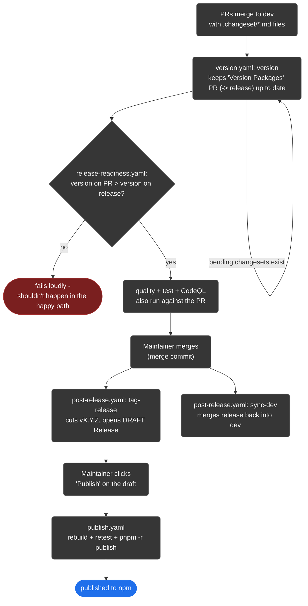

<!--suppress HtmlDeprecatedAttribute, HtmlUnknownTarget -->
<h1 id="title" align="center">Releasing</h1>

<div align="center">
  <h6>
    <a rel="noopener noreferrer" href="README.md">Readme</a>
    ·
    <a rel="noopener noreferrer" href="CODE_OF_CONDUCT.md">Code of Conduct</a>
    ·
    <a rel="noopener noreferrer" href="CONTRIBUTING.md">Contributing</a>
    ·
    <a rel="noopener noreferrer" href="SECURITY.md">Security Policy</a>
    ·
    <a rel="noopener noreferrer" href="SUPPORT.md">Support</a>
    ·
    <a rel="noopener noreferrer" href="LICENSE.md">License</a>
  </h6>
</div>

This repo uses [Changesets](https://github.com/changesets/changesets) for
versioning and [GitHub Releases](https://docs.github.com/en/repositories/releasing-projects-on-github)
to gate publishing, across two long-lived branches: `dev` (where all development
happens) and `release` (the tip of the last shipped release). This document is
the practical, command-first walkthrough; `.changeset/README.md` has the
Changesets basics.

<div align="center">
  <h2 id="overview">Overview</h2>
</div>

| Concept                  | Description                                                                                                                                                                                                                                                                                                                                                                            |
|--------------------------|----------------------------------------------------------------------------------------------------------------------------------------------------------------------------------------------------------------------------------------------------------------------------------------------------------------------------------------------------------------------------------------|
| **Fixed group**          | All four packages (`@octalmesh/seagull`, `-core`, `-cli`, `-docs`) version and publish together, in lockstep - see `.changeset/config.json`'s `fixed` field                                                                                                                                                                                                                            |
| **Changeset**            | A markdown file in `.changeset/` describing one change and its semver bump (patch/minor/major) - written by whoever makes the change, consumed by the `version` step                                                                                                                                                                                                                   |
| **Version Packages PR**  | An always-up-to-date PR that `version.yaml` maintains against `release`, bumping every package's `package.json` + `CHANGELOG.md` from pending changesets on top of dev's current changes. Merging it does **not** publish - it promotes dev's changes and bumps the version in one step; `release-readiness.yaml`, `quality.yaml`, `test.yaml`, `codeql.yaml` all still run against it |
| **Draft GitHub Release** | Auto-created by `post-release.yaml` the moment a new version lands on `release` - tag and changelog are already filled in, nothing is published to npm yet                                                                                                                                                                                                                             |
| **Publishing**           | The one deliberate, human-triggered step left: clicking "Publish" on that draft. Fires `publish.yaml`, which ships all four packages to npm                                                                                                                                                                                                                                            |

> [!NOTE]
> Versioning and publishing are separate, deliberate steps on purpose. Nothing
> reaches npm just because code reached `release` - a maintainer always has to
> publish the draft Release for that.

> [!IMPORTANT]
> This flow depends on three repo settings:
> - The "Version Packages" PR must be merged with a **merge commit** (not
>   squash/rebase), so `release`'s history stays a superset of `dev`'s and the
>   sync-back in step 5 below is a clean fast-forwardable merge instead of a
>   conflict-prone rewrite.
> - A `SYNC_PAT` repo secret (a PAT with `contents` and `pull-requests` access)
>   is needed for two things a default `GITHUB_TOKEN` can't do:
>   `post-release.yaml`'s `sync-dev` job pushing straight to `dev` past branch
>   protection, and `version.yaml` opening its PR in a way that actually
>   triggers `release-readiness.yaml`/`quality.yaml`/`test.yaml`/`codeql.yaml`
>   on it (PRs opened with the default `GITHUB_TOKEN` don't fire `pull_request`
>   workflows - GitHub's anti-recursion rule). Both jobs fall back to
>   `GITHUB_TOKEN` if `SYNC_PAT` isn't set, but then you'd have to nudge those
>   checks to run by hand (e.g. close/reopen the PR).
> - **Settings -> Actions -> General -> Workflow permissions -> "Allow GitHub
>   Actions to create and approve pull requests"** must be checked. This is
>   [called out in changesets/action's own docs](https://github.com/changesets/action) -
>   without it, the fallback path (default `GITHUB_TOKEN`, if `SYNC_PAT` isn't
>   set) can't open the Version Packages PR at all, full stop, not just the
>   "checks don't trigger" issue above.

<div align="center">
  <h2 id="adding-a-changeset">Day-to-day: adding a changeset</h2>
</div>

Every PR that changes published behavior should include a changeset:

```bash
pnpm run changeset
```

Follow the prompts (which packages changed, patch/minor/major, a one-line
summary) - it writes a Markdown file under `.changeset/`. Commit that file
alongside your PR. Because every package is in the same `fixed` group, you don't
need to think about which of the four packages actually needs the bump - picking
any one of them bumps all four together.

> [!TIP]
> Nothing to say beyond "this changed"? `pnpm run changeset:empty` writes an
> empty changeset (no version bump, no changelog entry) - useful for CI-only
> or docs-only PRs that still need a changeset file present to satisfy tooling
> that requires one.

Check what's pending without writing anything:

```bash
pnpm run changeset:status
```

<div align="center">
  <h2>Command Reference</h2>
</div>

| Command                     | What it does                                                                                                                                                      |
|-----------------------------|-------------------------------------------------------------------------------------------------------------------------------------------------------------------|
| `pnpm run changeset`        | Interactively add a new changeset                                                                                                                                 |
| `pnpm run changeset:empty`  | Add an empty changeset (no version bump)                                                                                                                          |
| `pnpm run changeset:status` | List pending changesets and the version bumps they'd produce, without writing anything                                                                            |
| `pnpm run version`          | Apply every pending changeset: bump all four `package.json`s, update `CHANGELOG.md`, delete the consumed changesets - normally run by `version.yaml`, not by hand |
| `pnpm run release`          | Full local release: `build` -> `test:run` -> `release:publish` - see [Publishing locally](#publishing-locally)                                                    |
| `pnpm run release:publish`  | `pnpm -r publish` across all four packages - resolves `workspace:*` deps to real semver, respects build order                                                     |
| `pnpm run release:dry`      | Same as `release:publish`, with `--dry-run` - prints what would be published without publishing                                                                   |

<div align="center">
  <h2 id="how-a-release-actually-happens">How a release actually happens</h2>
</div>



1. Land changesets. PRs merge to `dev` with `.changeset/*.md` files attached.
2. `version.yaml`'s `version` job runs on every push to `dev`. It keeps a single
   "Version Packages" PR up to date: takes `dev`'s current HEAD, runs
   `pnpm run version` on top of it (bumping every `package.json` +
   `CHANGELOG.md`), and opens that straight against `release` - one PR carries
   both the version bump and the full set of accumulated dev changes.
3. `quality.yaml`/`test.yaml`/`codeql.yaml` run against it like any other PR
   into `release`, and `release-readiness.yaml` double-checks the version really
   is ahead - a safety net, since a version bump is what this PR always carries
   in the happy path.
4. Merge it with a merge commit when you're ready to cut a release. This is the
   one merge in the whole flow where the strategy matters (see the settings note
   above) - it's what makes step 5's sync-back conflict-free.
5. `post-release.yaml` fires on that push to `release`, in two parallel jobs:
   - `tag-release` reads the version, skips if a matching tag already exists,
     otherwise cuts tag `vX.Y.Z` and opens a **draft** GitHub Release with the
     relevant `CHANGELOG.md` sections pre-filled.
   - `sync-dev` merges `release` straight back into `dev`, so the merge commit
     and version-bump commit never need reconciling by hand.
6. Publish the draft Release when you're ready - this is the one remaining
   manual click.
7. `publish.yaml` fires on that Release being published: checks out the release
   tag, rebuilds, re-tests, verifies the tag matches `package.json`'s version,
   then runs `pnpm run release:publish`.

> [!IMPORTANT]
> The release tag's version (`vX.Y.Z` -> `X.Y.Z`) must exactly match the root
> `package.json` version at that commit. Both `release-readiness.yaml` (before
> the merge) and `publish.yaml` (before publishing) check a version against its
> expected counterpart and fail loudly on mismatch.

<div align="center">
  <h2 id="publishing-locally">Publishing locally</h2>
</div>

Publishing normally happens through `publish.yaml` and never needs a human with
npm credentials on their own machine. If you do need to publish locally (e.g.
`publish.yaml` itself is down, or a one-off patch release):

1. Copy [`.env.example`](.env.example) to `.env` and set `NPM_TOKEN` to an npm
   access token with publish rights for the org.
2. Export it into your shell (Node doesn't load `.env` files on its own):
   ```bash
   export $(grep -v '^#' .env | xargs)
   ```
3. Save the authentication token to your global pnpm configuration (one-time
   setup per machine):
   ```bash
   pnpm config set //registry.npmjs.org/:_authToken "$NPM_TOKEN"
   ```
4. Make sure `release` is at the exact commit the `dev -> release` merge left it
   at (correct, already-bumped versions), then:
   ```bash
   pnpm run release:dry # sanity check, prints what would publish
   pnpm run release     # build, test, then actually publish all four packages
   ```
