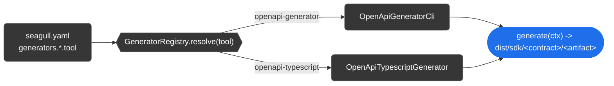

<!--suppress HtmlDeprecatedAttribute, HtmlUnknownTarget -->
<h1 id="title" align="center">@octalmesh/seagull-core</h1>

<div align="center">
  <!-- Version Badge -->
  <a rel="noopener noreferrer" href="https://npmjs.com/package/@octalmesh/seagull-core">
    <picture>
      <source media="(prefers-color-scheme: light)" srcset="https://img.shields.io/npm/v/@octalmesh/seagull-core?style=for-the-badge&label=Version&color=363636&labelColor=464646&logo=data:image/svg%2bxml;base64,PHN2ZyB4bWxucz0iaHR0cDovL3d3dy53My5vcmcvMjAwMC9zdmciIHdpZHRoPSIxNiIgaGVpZ2h0PSIxNiI+PHBhdGggZmlsbD0iI2ZmZiIgZD0iTTEgNy44di01UTEuMiAxLjIgMi44IDFoNXEuNyAwIDEuMi41bDYuMyA2LjNhMiAyIDAgMCAxIDAgMi40bC01IDVhMiAyIDAgMCAxLTIuNSAwTDEuNSA5QTIgMiAwIDAgMSAxIDcuOG0xLjUgMFY4bDYuMyA2LjJoLjRsNS01di0uNEw4IDIuNmwtLjItLjFoLTVsLS4zLjNaTTYgNWExIDEgMCAxIDEgMCAyIDEgMSAwIDAgMSAwLTIiLz48L3N2Zz4=" />
      
    </picture>
  </a>
  <!-- NPM Downloads Badge -->
  <a rel="noopener noreferrer" href="https://www.npmjs.com/package/@octalmesh/seagull-core">
    <picture>
      <source media="(prefers-color-scheme: light)" srcset="https://img.shields.io/npm/dm/@octalmesh/seagull-core?style=for-the-badge&logo=npm&color=363636&labelColor=464646" />
      
    </picture>
  </a>
  <!-- License Badge -->
  <a rel="noopener noreferrer" href="LICENSE.md">
    <picture>
      <source media="(prefers-color-scheme: light)" srcset="https://img.shields.io/github/license/OctalMesh/Seagull?style=for-the-badge&color=363636&labelColor=464646&logo=data:image/svg%2bxml;base64,PHN2ZyB4bWxucz0iaHR0cDovL3d3dy53My5vcmcvMjAwMC9zdmciIHdpZHRoPSIxNiIgaGVpZ2h0PSIxNiI+PHBhdGggZmlsbD0iI2ZmZiIgZD0iTTguOC44VjJoMXEuMyAwIC44LjJsMS4zLjhoMi40YS44LjggMCAwIDEgMCAxLjVoLS41TDE2IDkuMmExIDEgMCAwIDEtLjEuOGwtLjUtLjUuNS41di4xbC0uOC40cS0uNi41LTIgLjVhNSA1IDAgMCAxLTItLjVsLS43LS40YTEgMSAwIDAgMS0uMi0xbDItNC42cS0uNiAwLTEtLjJMMTAgMy41SDguN1YxM2gyLjZhLjguOCAwIDAgMSAwIDEuNUg0LjhhLjguOCAwIDAgMSAwLTEuNWgyLjVWMy41SDZMNSA0LjNsLTEgLjIgMiA0LjdhMSAxIDAgMCAxLS4xLjhsLS41LS41LjUuNXYuMWwtLjguNHEtLjYuNS0yIC41YTUgNSAwIDAgMS0yLS41bC0uNy0uNEExIDEgMCAwIDEgMCA5bDItNC42aC0uNGEuOC44IDAgMCAxIDAtMS41aDIuNGwxLjMtLjguOS0uMmgxVi44YS44LjggMCAwIDEgMS41IDBtMi45IDguNHEuNC4zIDEuMy4zYy45IDAgMS0uMSAxLjMtLjNMMTMgNi4zWm0tMTAgMHEuNC4zIDEuMy4zYy45IDAgMS0uMSAxLjMtLjNMMyA2LjNaIi8+PC9zdmc+" />
      
    </picture>
  </a>
</div>

<div align="center">
  <h6>
    <a rel="noopener noreferrer" href="../../README.md">Main Readme</a>
    ·
    <a rel="noopener noreferrer" href="../cli/README.md">seagull-cli</a>
    ·
    <a rel="noopener noreferrer" href="../docs/README.md">seagull-docs</a>
  </h6>
</div>

Published independently for anyone who wants just this piece - e.g. scripting
against `loadConfig()` without pulling in the CLI's `commander` dependency or
the docs bundle. Most people should install [`@octalmesh/seagull`](../..)
instead, which bundles this package (and `-cli`/`-docs`) into one.

<div align="center">
  <h2 id="what-lives-here">What lives here</h2>
</div>

| Path               | What it is                                                                                                                        |
|--------------------|-----------------------------------------------------------------------------------------------------------------------------------|
| `config/`          | The `seagull.yaml` zod schema, loader, `{...}` template engine, `paths.specFormat` helpers, and publishing-conventions resolution |
| `generator/`       | The `Generator` abstract primitive and the `GeneratorRegistry` every concrete generator plugs into                                |
| `generators/`      | The built-in `openapi-generator-cli` and `openapi-typescript` generator implementations                                           |
| `readme/`          | README rendering for generated SDK artifacts (custom template or built-in default, per language/kind)                             |
| `redocly/`         | Keeps `redocly.yaml` in sync with `seagull.yaml`                                                                                  |
| `version/`         | `hashSpec`/`resolveVersion` - content hashing and `info.version` extraction from a bundled spec                                   |
| `git/`, `process/` | Small git/process utilities (`run`, `resolveBinPath`, `assertSafeRefName`, ...) used by the pipeline commands                     |

<div align="center">
  <h2 id="the-generator-primitive">The Generator primitive</h2>
</div>



`GeneratorRegistry` looks up one `Generator` instance per **tool** (`SdkTool`,
currently `"openapi-generator" | "openapi-typescript"` - a closed union, not an
open plugin-name string) - one instance per underlying tool, not per language,
since a single `openapi-generator-cli -g java`/`-g go` invocation already covers
every language that tool supports.

```ts
import { Generator, GeneratorRegistry } from "@octalmesh/seagull-core";
import type { GenerateContext } from "@octalmesh/seagull-core";

class MyOpenApiGeneratorCli extends Generator {
  readonly tool = "openapi-generator"; // must be an existing SdkTool value

  async generate(ctx: GenerateContext): Promise<void> {
    // your own openapi-generator-cli invocation, patching, etc.
  }
}

const registry = new GeneratorRegistry().register(new MyOpenApiGeneratorCli());
```

`tool` is typed `SdkTool`, so this is swapping the *implementation* behind an
existing tool name (useful if you want different generator behavior than the
built-in `OpenApiGeneratorCli`/`OpenApiTypescriptGenerator`, in your own script
built on `loadConfig()` + a custom `GeneratorRegistry`) - it's not a way to add
a brand-new third tool name to `generators.*.tool` in `seagull.yaml` itself,
since the CLI's own registry and the config schema both only know about the two
built-in values today.

<div align="center">
  <!--
  =====================
         FOOTER
  =====================
  -->
  <h1></h1>
  <br />
  <!-- OctalMesh Logo -->
  <a rel="noopener noreferrer" target="_blank" href="https://octalmesh.com">
    <picture>
      <source media="(prefers-color-scheme: light)" srcset="https://raw.githubusercontent.com/OctalMesh/OctalDesign/release/assets/logo/svg/octal_mesh_center.svg" />
      
    </picture>
  </a>
  <br /><br />
  <!-- Socials -->
  <div>
    <!-- Telegram Badge -->
    <a rel="noopener noreferrer" target="_blank" href="https://octalmesh.com/telegram">
      <picture>
        <source media="(prefers-color-scheme: light)" srcset="https://raw.githubusercontent.com/OctalMesh/OctalDesign/release/assets/icon/svg/telegram.svg" />
        
      </picture>
    </a>
    &nbsp;
    <!-- YouTube Badge -->
    <a rel="noopener noreferrer" target="_blank" href="https://octalmesh.com/youtube">
      <picture>
        <source media="(prefers-color-scheme: light)" srcset="https://raw.githubusercontent.com/OctalMesh/OctalDesign/release/assets/icon/svg/youtube.svg" />
        
      </picture>
    </a>
    &nbsp;
    <!-- TikTok Badge -->
    <a rel="noopener noreferrer" target="_blank" href="https://octalmesh.com/tiktok">
      <picture>
        <source media="(prefers-color-scheme: light)" srcset="https://raw.githubusercontent.com/OctalMesh/OctalDesign/release/assets/icon/svg/tiktok.svg" />
        
      </picture>
    </a>
    &nbsp;
    <!-- Instagram Badge -->
    <a rel="noopener noreferrer" target="_blank" href="https://octalmesh.com/instagram">
      <picture>
        <source media="(prefers-color-scheme: light)" srcset="https://raw.githubusercontent.com/OctalMesh/OctalDesign/release/assets/icon/svg/instagram.svg" />
        
      </picture>
    </a>
    &nbsp;
    <!-- X Badge -->
    <a rel="noopener noreferrer" target="_blank" href="https://octalmesh.com/x">
      <picture>
        <source media="(prefers-color-scheme: light)" srcset="https://raw.githubusercontent.com/OctalMesh/OctalDesign/release/assets/icon/svg/x.svg" />
        
      </picture>
    </a>
    &nbsp;
    <!-- Reddit Badge -->
    <a rel="noopener noreferrer" target="_blank" href="https://octalmesh.com/reddit">
      <picture>
        <source media="(prefers-color-scheme: light)" srcset="https://raw.githubusercontent.com/OctalMesh/OctalDesign/release/assets/icon/svg/reddit.svg" />
        
      </picture>
    </a>
  </div>
</div>
<h6>
  <div align="center">
    • • •
    <br /><br />
    This project is licensed under the <a rel="noopener noreferrer" href="../../LICENSE.md">MIT License</a>
    <br /><br />
  </div>
  <div align="justify">
    <ul>
      <li>Feel free to use this project for any purpose, including commercial applications.</li>
      <li>You are permitted to modify, distribute, and include this project in any form, as long as the original copyright notice is retained.</li>
      <li>If you share or publish modified versions, attribution to the original <a rel="noopener noreferrer" href="https://github.com/OctalMesh/Seagull">GitHub repository</a> is appreciated.</li>
      <li>This software is provided "as is", without any warranties or guarantees, as detailed in the license terms.</li>
    </ul>
  </div>
</h6>
